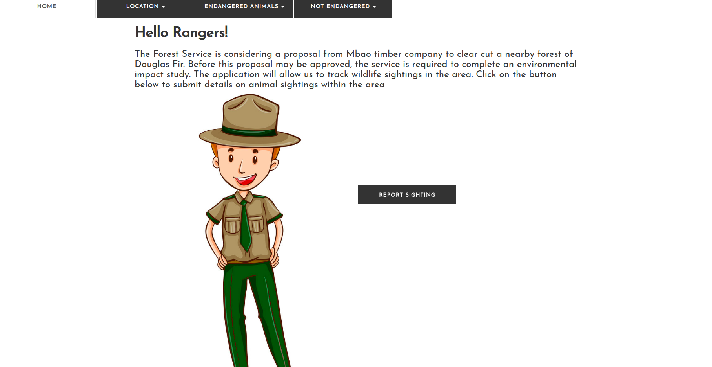
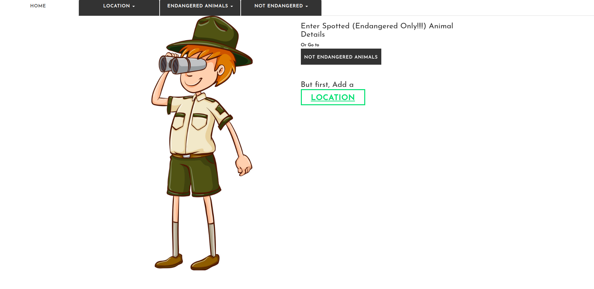
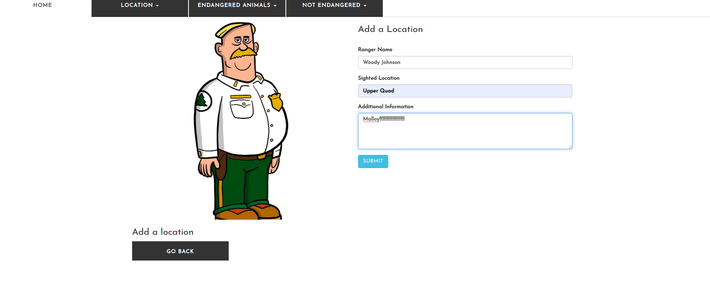
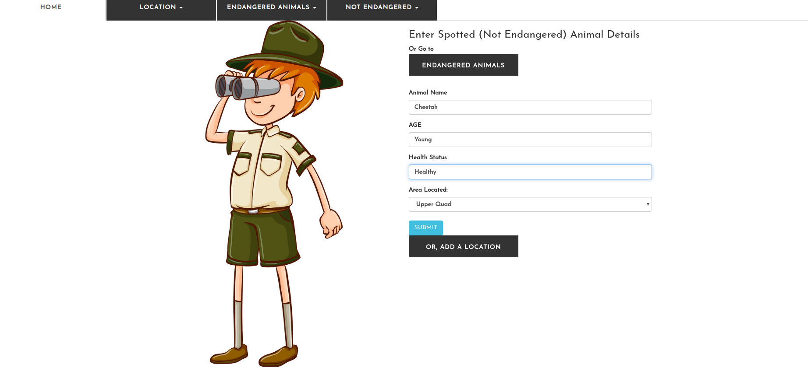
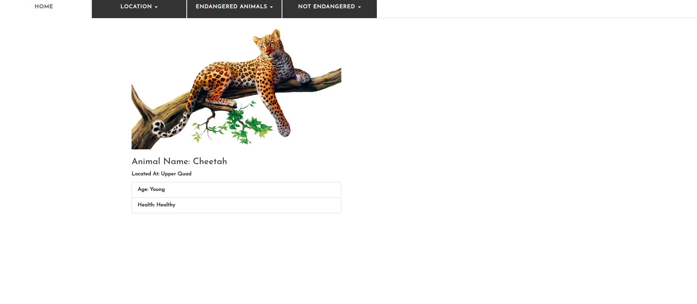
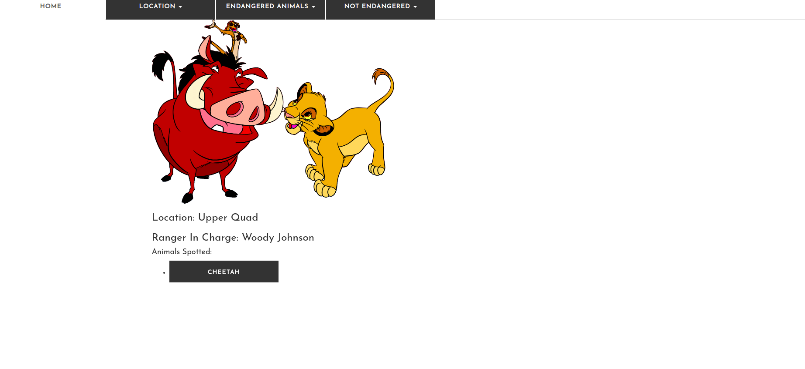
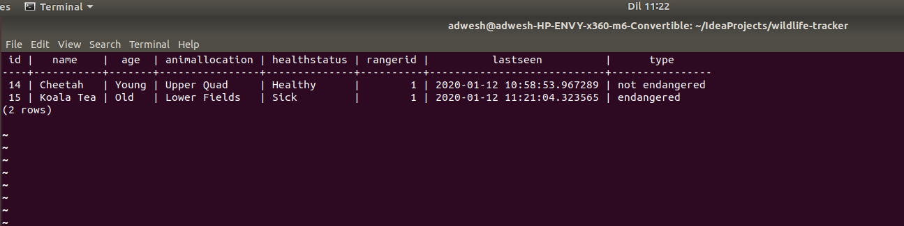

# Wildlife Tracker

#### Report wildlife trackings within an area complete with the location details and animal details

#### By Shadrack Adwera

## Description

An animal abstract class has been used whereby endangered animals and those that are not endangered inherit features from. The objects created are strored in the Postgres database complete with timestamps of when an abject is created through form inputs.

## Setup/Installation Requirements

* You need to install the [Java SDK](https://sdkman.io/install) in order to create Java applications and the [Java Runtime Environment](https://sdkman.io/usage) which provides the requirements for executing a Java application.
* The code can be run on any java IDE: NetBeans, IntelliJ IDEA, Eclipse etc
* On ItelliJ, simply run the command **$ gradle run** and navigate to **localhost:4567** to view the website
* A postgres database also needs to be [installed](https://www.2ndquadrant.com/en/blog/pginstaller-install-postgresql/)
* Once installed, fire up the database by typing on the terminal **$ psql** and you can now create a [user with a password](https://www.postgresql.org/docs/8.0/sql-createuser.html) . Make sure to edit the DB.java file with the credentails created in order to connect to your database.
* Once a user is created, create a database using the command: **user# CREATE DATABASE database_name;**
* Then create tables to store animal details and sighting details **database_name# CREATE TABLE animals VALUES (enter your table_name columns)**
* Create a table to store sighting details too.
* Upon a successfull submission of a from, you can view the entiries in the tables through the sql command: **database_name# SELECT * FROM animals;**

## Behaviour driven design

Wildlife Tracker

1. Displays add a location form when add an location link is clicked
    * INPUT: "Add a sighting is clicked"
    * OUTPUT: "Displays add a location form"
2. Displays add an animal form when add an animal link is clicked
    * INPUT: "Add an animal link is clicked"
    * OUTPUT: "Displays add an animal form"
3. Displays animal details, endangered or not upon clicking of an animal name
    * INPUT: "Animal name is clicked"
    * OUTPUT: "Displays animal details"
4. Displays location details, with animals spotted in a location when location name, nested in the locations nav item, on the nav bar is clicked
    * INPUT: "Location name is clicked"
    * OUTPUT: "Displays location details"
5. Displays field required when any of the form inputs is ommitted on either forms
    * INPUT: ""
    * OUTPUT: "Field name required"
6. Redirects to the home page upon addition of a location or animal is clicked
    * INPUT: "Clicked submit location/animal button"
    * OUTPUT: "Home page"

## Overview

* Upon loading the website, the homepage is displayed

* By clicking the button to report a sighting, the page below is loaded, where a location must be reported first

* On clicking the add a location link, the page below loads. Where a ranger can also add their name

* After adding a location where an animal was spotted, the animal can now be added, either endangered or not.

* The animal details can be viewed by clicking on the animal name, nested below the endangered or not endangered nav bar item.

* The location and the animals spotted can be viewed by clicking on the location name

* View of entries in postgres, endangered animals or not 

* Check out the live link: 

## Routing

| Route Name     | URL                                   | HTTP Verb     | Description                         |
|---             |---                                    |---            |---                                  |
| index          | /                                     | GET           | Displays the landing page           |
| location       | /location/new                         | GET           | Displays add a location form        |
| location       | /location                             | POST          | Process add a location form         |
| location-animal| /location/:id                         | GET           | View location and animals spotted   |
| animal         | /animal/new                           | GET           | Displays add an animal form         |
| animal         | /animal                               | POST          | Process add an animal form          |
| animal-detail  | /location/:locationId/animal/:animalId| GET           | Show an individual endangered animal|
| not-endangered | /location/animal/:animalId            | GET           | Show not endangered animal          |

## Known Bugs

* Incase any bug is found, or a request for a new fuctionality is needed, kindly open an issue [here](https://github.com/ShadrackAdwera/Wildlife-Tracker/issues/new)

## Technologies Used

* IntelliJ IDEA
* PostgreSQL

## Support and contact details

Feel free to contribute to the project by:

* Forking the repo
* Create a new branch (git branch my-contribution)
* Move to your branch (git checkout my-contribution)
* Make the changes in the files
* Add changes to reflect the changes made
* Commit your changes (git commit -m "Added features")
* Push to the branch (git push origin my-contriution)
* Create a Pull Request

Incase of any feedback/comments feel free to contact me at adweshshaddie@gmail.com

### License

#### Copyright (c) 2019 Shadrack Adwera

#### Licenced under the [MIT License](LICENSE)
